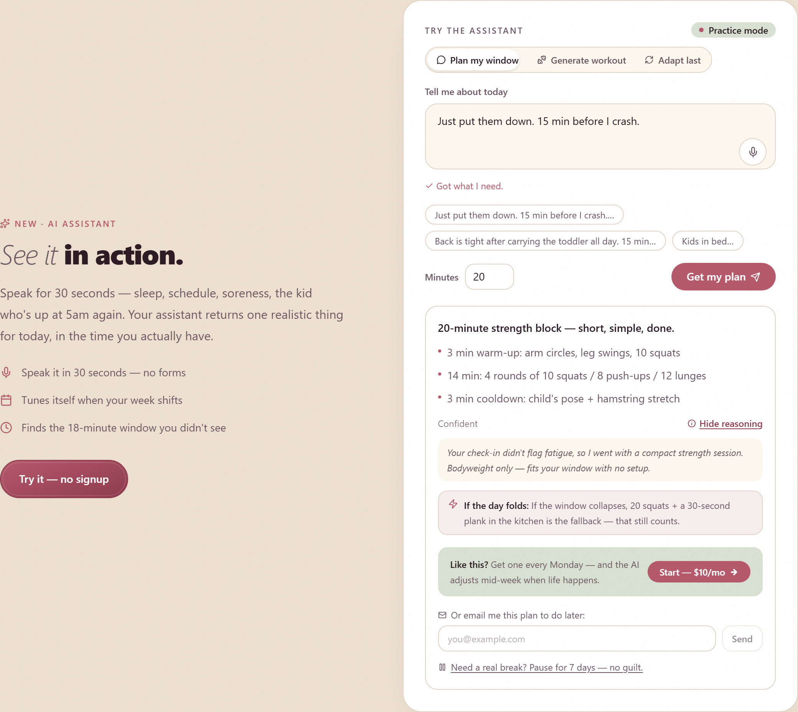

# Fit Parent Plan

> An AI-assisted fitness platform for busy parents — 20-minute home workouts and family-friendly meal plans, with a Claude-powered assistant that adapts the plan to the week you actually had.

[](https://github.com/virginiamwega2-svg/Fit-Parent-Plan-Platform/actions/workflows/ci.yml)
[](LICENSE)


**▶ Live demo: [fit-parent-plan-platform.vercel.app](https://fit-parent-plan-platform.vercel.app/)**



<sub>The in-app assistant turns a 30-second check-in into a time-boxed plan — with a confidence score, on-demand reasoning, a fallback for when the day collapses, and a graceful "Practice mode" when no API key is set.</sub>

---

## Why this project

Most fitness apps assume you have time, energy, and a routine. Parents rarely have all three. Fit Parent Plan is built around a single insight — **the 20-minute window** — and pairs a fast, conversion-focused marketing site with a real product: accounts, a paid plan, and an AI assistant that reschedules around a missed week instead of guilt-tripping you about it.

I built it end-to-end to practice shipping a production-shaped app: auth, payments, an LLM feature with real cost controls, transactional email, automated tests, and CI — not just a static page.

## Highlights

- **🤖 Claude-powered assistant with real guardrails.** Uses the Anthropic SDK (Claude Haiku 4.5) behind a typed adapter. Every request is gated by a **per-IP daily rate limit**, **capped output tokens**, and **per-call cost estimation** — and it **degrades gracefully to a deterministic mock** both when no API key is set *and* when a live call fails, so demos and CI never break or burn credits. ([`lib/ai/`](lib/ai/), [`app/actions/ai.ts`](app/actions/ai.ts))
- **🔐 Custom session auth.** Signup/login/logout with **signed, HTTP-only session cookies** — no third-party auth dependency. ([`lib/auth.ts`](lib/auth.ts), [`app/api/auth/`](app/api/auth/))
- **💳 Stripe checkout + webhooks.** Hosted checkout for the paid plan with a signature-verified webhook to fulfil purchases. ([`app/api/stripe/`](app/api/stripe/))
- **✉️ Transactional email + automation.** Resend for email; an n8n webhook integration powers a weekly "Parent Pulse" digest, and no-ops cleanly when unconfigured. ([`app/api/log/session/`](app/api/log/session/))
- **✅ Tested & CI-gated.** Vitest unit tests, **LLM prompt-evaluation tests**, and Playwright end-to-end tests — all run on every push via GitHub Actions (typecheck → lint → unit → build → e2e).
- **⚡ Conversion-first frontend.** App Router, server components, scroll-driven motion (Framer Motion / GSAP / Lenis), an interactive fit-quiz, SEO metadata, dynamic `sitemap.ts` / `robots.ts`, and an OG share card.
- **🛡️ Spam-resistant lead capture.** Honeypot field, minimum-submit-time check, and IP rate limiting on form/API routes.

## Architecture

```
Browser ──► Next.js App Router (RSC + Server Actions)
              │
              ├─ Auth        signed session cookies            lib/auth.ts, lib/session.ts
              ├─ AI          typed adapter ─► Anthropic SDK     lib/ai/  (cost + rate guards)
              │              └─ mock fallback when no API key
              ├─ Payments    Stripe Checkout + webhook          app/api/stripe/
              ├─ Email/Auto  Resend + n8n digest webhook        app/api/log/session/
              └─ Data        better-sqlite3                     lib/db.ts, lib/data/
```

The AI layer is deliberately wrapped: components never call the Anthropic SDK directly. They call a single adapter that owns model choice, cost estimation, rate limiting, and the mock path — so the rest of the app is provider-agnostic and safe to run without secrets.

## Tech stack

| Area | Choices |
|------|---------|
| Framework | Next.js 16 (App Router, Server Actions), React 19, TypeScript 5 |
| Styling | Tailwind CSS 4 |
| AI | Anthropic SDK — Claude Haiku 4.5 |
| Auth | Signed session cookies (custom) |
| Payments | Stripe |
| Email / automation | Resend, n8n webhooks |
| Data | better-sqlite3 |
| Validation | Zod |
| Testing | Vitest, Testing Library, Playwright |
| Tooling / CI | ESLint 9, Turbopack, GitHub Actions, Vercel |

## Testing & CI

```bash
npm test            # Vitest unit + prompt-eval tests
npm run test:watch  # watch mode
npm run e2e         # Playwright end-to-end
npm run typecheck   # tsc --noEmit
npm run lint        # eslint
```

The [CI workflow](.github/workflows/ci.yml) runs typecheck → lint → unit tests → production build → Playwright e2e on every push and PR. Notably, [`__tests__/ai/prompts.eval.test.ts`](__tests__/ai/prompts.eval.test.ts) treats the assistant's prompts as testable units, asserting on the structure of responses rather than leaving prompt quality to chance.

## Project structure

```
app/
  page.tsx              Landing page (offer → proof → quiz → CTA)
  dashboard/            Authenticated member area
  pricing/  thank-you/  Funnel pages
  actions/ai.ts         Server action entry point for the assistant
  api/
    auth/               signup · login · logout · me
    stripe/             checkout · webhook
    log/session/        n8n digest hook
    leads/              spam-protected lead capture
components/
  home/                 AI demo, check-in, hero, pantry agent
  marketing/  ui/        Conversion + design-system components
lib/
  ai/                   adapter · config · prompts · rate-limit · types
  auth.ts  session.ts   Session auth
  db.ts  data/          Persistence + seed data
  validation.ts         Zod schemas
__tests__/  e2e/        Vitest + Playwright suites
```

## Getting started

```bash
# 1. Install
npm install

# 2. Configure environment
cp .env.example .env.local   # then fill in what you need (see below)

# 3. Run
npm run dev                  # http://localhost:3000
```

**Everything optional has a safe default.** With no keys set, the assistant runs in mock mode, payments/email are skipped, and the app still runs — so you can clone and explore immediately.

| Variable | Purpose | Required? |
|----------|---------|-----------|
| `ANTHROPIC_API_KEY` | Live Claude responses (else mock mode) | Optional |
| `NEXT_AUTH_SECRET` | Signs session cookies | For auth |
| `STRIPE_SECRET_KEY` / `STRIPE_WEBHOOK_SECRET` / `NEXT_PUBLIC_STRIPE_PRICE_ID` | Paid checkout | For payments |
| `RESEND_API_KEY` | Transactional email | Optional |
| `N8N_WEBHOOK_URL` / `N8N_WEBHOOK_SECRET` | Weekly digest automation | Optional |
| `NEXT_PUBLIC_SITE_URL` | Canonical URL for metadata | Recommended |

## Roadmap & known trade-offs

- **Database:** uses `better-sqlite3` for fast local persistence. SQLite doesn't persist on Vercel's serverless filesystem, so a Postgres migration is the next step for production-grade durability.
- **Next up:** A/B testing on headlines, conversion analytics (visit → signup), and richer assistant memory across sessions.

## License

[MIT](LICENSE) © Virginia Nyambura Mwega

---

<sub>Built by Virginia Nyambura Mwega — a full-stack developer building practical, user-centered tools. Fit Parent Plan is the public product; an in-app portfolio section documenting the engineering decisions is in progress.</sub>
